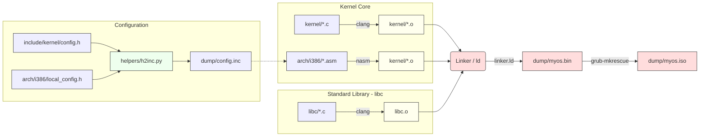

# Build System & Toolchain

This document details the build process, dependencies, and command-line utilities used to compile TilekarOS.

## Build Pipeline Overview

The build system utilizes **GNU Make** to orchestrate the compilation of C source code, assembly of ASM files, and linking of the final kernel binary.

### dependency Graph & Workflow

## Prerequisite Tools

To build TilekarOS, you need the following tools installed in your path:

*   **`clang`**: The C compiler (targeting `i386-elf` or generally 32-bit).
*   **`nasm`**: The Netwide Assembler for `.asm` files.
*   **`ld.lld`** (or GNU `ld`): The linker.
*   **`make`**: Build automation tool.
*   **`grub-mkrescue`**: Part of the GRUB suite, used to generate the ISO.
*   **`xorriso`**: Required by `grub-mkrescue`.
*   **`python3`**: Required for the configuration helper scripts.
*   **`qemu-system-i386`**: Emulator for running the OS.

## Make Commands

Run these commands from the root directory:

| Command | Description |
| :--- | :--- |
| `make` | Compiles the kernel binary (`dump/myos.bin`). |
| `make iso` | Generates a bootable ISO image (`dump/myos.iso`). |
| `make run` | Runs the raw kernel binary in QEMU (Fast boot). |
| `make run_iso` | Boots the full ISO in QEMU (Recommended for testing GRUB/Multiboot). |
| `make debug` | Compiles the kernel with **DWARF** debug symbols (`-g`). |
| `make rund` | Starts QEMU in **Suspended Mode** (`-s -S`). Connect via GDB. |
| `make clean` | Removes the `dump/` directory and all build artifacts. |

## Helper Scripts

### `helpers/h2inc.py`
**Purpose**: Bridges C and Assembly configuration.
**Problem**: We define constants like GDT Segment Offsets (`0x08`, `0x10`) in C headers. Assembly files need these same values. Hardcoding them in two places leads to bugs.
**Solution**: This Python script parses C headers (`#define VAR VAL`) and generates a corresponding NASM include file (`%define VAR VAL`).

*   **Input**: `kernel/include/kernel/config.h`
*   **Output**: `dump/config.inc` (Included by `.asm` files)
