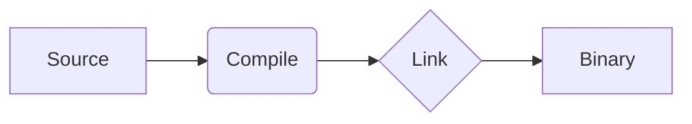

# Documentation Guide

This guide explains how to write and maintain documentation for the TilekarOS project.

## 1. Structure

Documentation is organized into logical sections:

- `getting-started/`: Installation, building, and running.
- `kernel/`: Core internals (memory, tasks, interrupts).
- `drivers/`: Hardware-specific implementation details.
- `api/`: Programmer-facing system calls and LibC reference.
- `development/`: Coding standards and contribution guides.

---

## 2. Mermaid Diagrams

TilekarOS uses **Mermaid.js** for architectural diagrams. This allows us to keep diagrams in version control as text.

### Example:


### Tips for Mermaid:
- Use `stateDiagram-v2` for state machines.
- Use `block-beta` for memory layouts.
- Use `classDiagram` for data structures (TCB, VNode, etc.).

---

## 3. Snippets (Including External Code)

To include code from outside the `docs/` folder, use the `pymdownx.snippets` syntax. The base path is set to the project root.

### Usage:
```markdown
#<--8<-- "path/to/file.c:start_line:end_line"
```

---

## 4. Writing Style

- **Be Concise**: Use high-signal language. Avoid fluff.
- **Code Blocks**: Always specify the language (e.g., ````c`, ````asm`, ````mermaid`).
- **Headings**: Use hierarchical headings (`#`, `##`, `###`).
- **Admonitions**: Use `!!! info`, `!!! tip`, `!!! danger` to highlight important information.

---

## 5. How to Contribute

We welcome documentation improvements!

1.  **Find a Gap**: Look for missing explanations, unclear diagrams, or outdated examples.
2.  **Edit Markdown**: Modify the files in the `docs/` directory.
3.  **Preview**: Run `mkdocs serve` to see your changes locally.
4.  **Submit**: Create a Pull Request with your improvements.

---

## 6. Previewing Docs

TilekarOS uses **MkDocs** with the **Material** theme.

1. Install dependencies:
   ```bash
   pip install mkdocs-material
   ```
2. Serve the docs locally:
   ```bash
   mkdocs serve
   ```
3. Open `http://127.0.0.1:8000` in your browser.

---

## References
- [MkDocs Material Documentation](https://squidfunk.github.io/mkdocs-material/)
- [Mermaid.js Documentation](https://mermaid.js.org/)
- [PyMdown Extensions (Snippets)](https://facelessuser.github.io/pymdown-extensions/extensions/snippets/)
