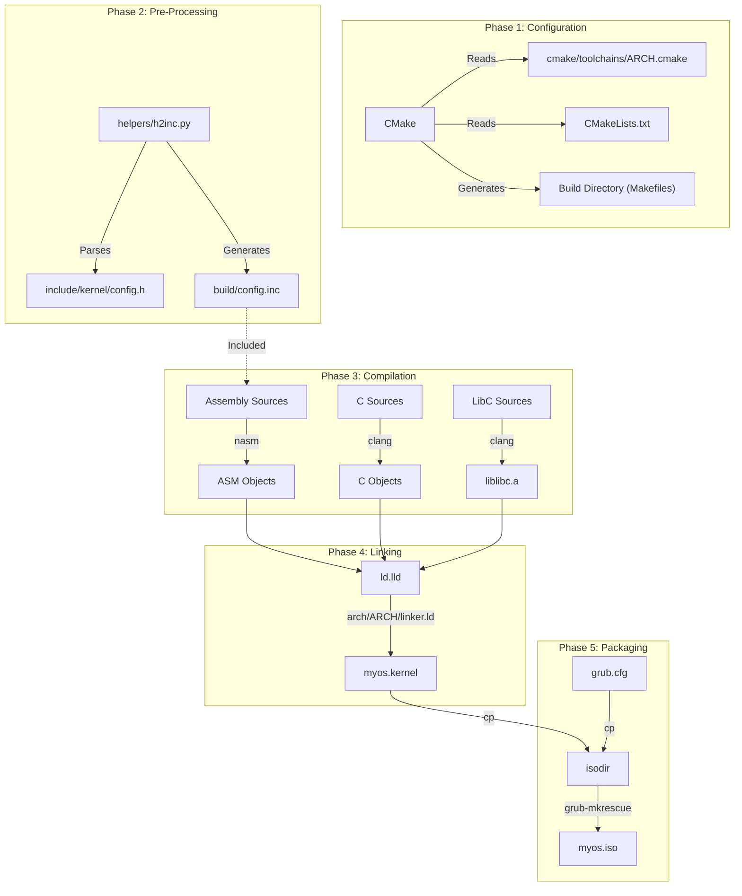

# Build System Internals & Developer Guide

This document is the definitive guide to the TilekarOS build system. It is designed for developers who need to understand, extend, or debug the compilation process.

## 1. Philosophy & Architecture

TilekarOS uses **CMake** (v3.15+) as its primary build system generator. While `Makefiles` exist in the project, they are thin wrappers (Facades) intended for user convenience (`make`, `make iso`), while CMake handles the heavy lifting of dependency graph generation, compiler configuration, and cross-compilation toolchains.

### Why CMake?
*   **Cross-Platform**: Generates Makefiles, Ninja build files, or VS Code / IDE projects seamlessly.
*   **Multi-Architecture**: Easy switching between `i386`, `x86_64`, `arm`, etc., using toolchain files.
*   **Dependency Management**: Correctly handles complex chains like *C Header $\rightarrow$ Python Script $\rightarrow$ ASM Include $\rightarrow$ ASM Object $\rightarrow$ Kernel Binary*.

### The Build Pipeline

The build process transforms raw C and Assembly source code into a bootable ISO image.



---

## 2. Directory Structure & Organization

The build system relies on a strict directory hierarchy to locate architecture-specific code.

```text
/
├── CMakeLists.txt           # Root configuration
├── Makefile                 # Wrapper for CMake
├── cmake/
│   └── toolchains/
│       ├── i386.cmake       # Toolchain for i386-elf
│       └── x86_64.cmake     # (Future) Toolchain for x86_64-elf
├── kernel/
│   ├── CMakeLists.txt       # Kernel target definition
│   └── arch/
│       ├── i386/            # i386 specific C/ASM code & linker scripts
│       └── x86_64/          # (Future) x86_64 specific code
├── libc/
│   ├── CMakeLists.txt       # LibC target definition
│   └── arch/
│       └── i386/            # Architecture-optimized LibC functions
└── sysroot/                 # Virtual filesystem root for cross-compilation
```

---

## 3. Multi-Architecture Support

The build system is designed to be **Architecture Agnostic**. The target architecture is controlled by the `OS_ARCH` variable.

### How it works
1.  **Selection**: The user selects an architecture (default: `i386`).
    ```bash
    make ARCH=i386     # Default
    make ARCH=x86_64   # (Example)
    ```
2.  **Toolchain Loading**: CMake looks for `cmake/toolchains/${OS_ARCH}.cmake`. This file sets the compiler (`clang`), assembler (`nasm`), and target flags (`--target=...`).
3.  **Source Selection**:
    *   **Kernel**: `kernel/CMakeLists.txt` globs files from `kernel/arch/${OS_ARCH}/*`.
    *   **LibC**: `libc/CMakeLists.txt` globs files from `libc/arch/${OS_ARCH}/*`.
4.  **Emulation**: The `run` targets dynamically choose the emulator (e.g., `qemu-system-${OS_ARCH}`).

### Adding a New Architecture

To port TilekarOS to a new architecture (e.g., `riscv64`):

1.  **Create Toolchain**: Add `cmake/toolchains/riscv64.cmake`.
    ```cmake
    set(CMAKE_SYSTEM_PROCESSOR riscv64)
    set(CMAKE_C_COMPILER_TARGET riscv64-unknown-elf)
    # ... set CMAKE_ASM_COMPILER ...
    ```
2.  **Create Kernel Arch Directory**: Create `kernel/arch/riscv64/`.
    *   Add `boot.asm` / `entry.S`.
    *   Add `linker.ld` (Linker script).
    *   Add `local_config.h`.
3.  **Create LibC Arch Directory**: Create `libc/arch/riscv64/`.
    *   Add architecture-specific optimizations (or leave empty if generic C is fine).
4.  **Build**: Run `make ARCH=riscv64`.

---

## 4. Helper Scripts & Custom Commands

### `helpers/h2inc.py` (The Bridge)
**Problem**: We define constants like `GDT_OFFSET_KERNEL_CODE = 0x08` in C header files (`config.h`). The assembly code (`boot.asm`) needs these exact values to set up segments. Hardcoding them in two places leads to "Magic Number" bugs.

**Solution**:

1.  CMake invokes `h2inc.py` during the build.
2.  The script reads C `#define` macros.
3.  It outputs a NASM-compatible `%define` file (`build/config.inc`).
4.  NASM files include this generated file via the `-P` flag.

**Usage in CMake**:
```cmake
add_custom_command(
    OUTPUT ${CONFIG_INC}
    COMMAND Python3::Interpreter "${CMAKE_SOURCE_DIR}/helpers/h2inc.py" ${CONFIG_H} ${CONFIG_INC}
    ...
)
```

---

## 5. IDE Integration (.clangd)

To ensure a smooth development experience in editors like **VS Code** or **Zed** (which use `clangd`), the root `CMakeLists.txt` generates a `.clangd` file.

This file tells the language server:
*   We are cross-compiling (e.g., `--target=i386-elf`).
*   Where to find the kernel headers (`-Ikernel/include`).
*   Where to find the system headers (`-Isysroot/usr/include`).

**Result**: You get accurate Autocomplete and Error Checking for the target OS, not the host Linux system.

---

## 6. Command Reference

| Command | Variables | Description |
| :--- | :--- | :--- |
| `make` | `ARCH=...` | Builds the kernel binary. |
| `make iso` | `ARCH=...` | Builds the bootable ISO image. |
| `make run` | `ARCH=...` | Runs the kernel binary directly in QEMU. |
| `make run_iso` | `ARCH=...` | Boots the ISO in QEMU (Tests GRUB integration). |
| `make clean` | | Removes the `build/` directory. |
| `make configure` | `ARCH=...` | Re-runs the CMake configuration step manually. |

**Example**:
```bash
# Build and run the ISO for i386
make run_iso

# Build for x86_64 (assuming files exist)
make ARCH=x86_64
```
