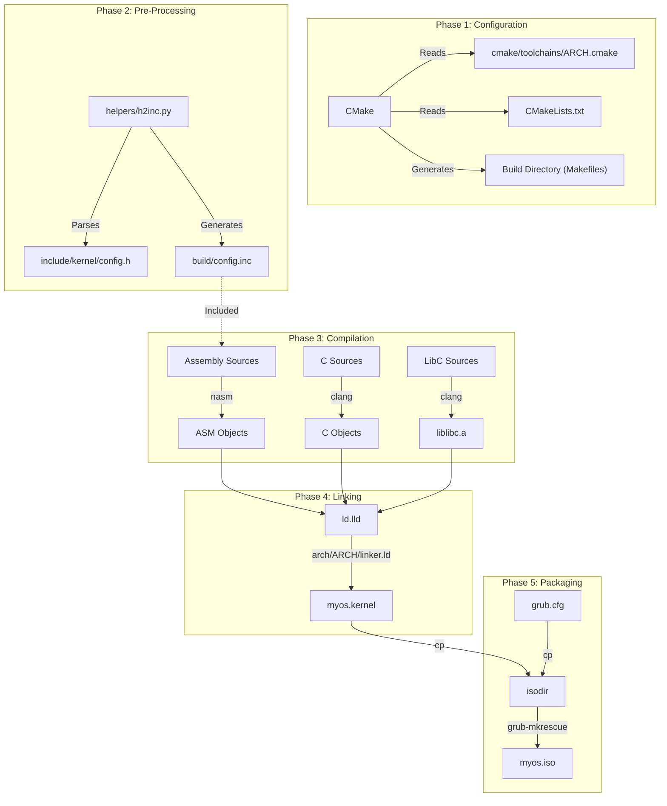

# Build System Internals & Developer Guide

This document is the definitive guide to the TilekarOS build system. It is designed for developers who need to understand, extend, or debug the compilation process.

## 1. Philosophy & Architecture

TilekarOS uses **CMake** (v3.15+) as its primary build system generator. While `Makefiles` exist in the project, they are thin wrappers (Facades) intended for user convenience (`make`, `make iso`), while CMake handles the heavy lifting of dependency graph generation, compiler configuration, and cross-compilation toolchains.

### Why CMake?
*   **Cross-Platform**: Generates Makefiles, Ninja build files, or VS Code / IDE projects seamlessly.
*   **Multi-Architecture**: Easy switching between `i386`, `x86_64`, `arm`, etc., using toolchain files.
*   **Dependency Management**: Correctly handles complex chains like *C Header $\rightarrow$ Python Script $\rightarrow$ ASM Include $\rightarrow$ ASM Object $\rightarrow$ Kernel Binary*.

### The Build Pipeline

The build process transforms raw C and Assembly source code into a bootable ISO image.



---

## 2. Multi-Architecture Support

The build system is designed to be **Architecture Agnostic**. The target architecture is controlled by the `OS_ARCH` variable.

### Toolchain Example:
See [i386.cmake](https://github.com/SohamTilekar/TilekarOS/blob/main/cmake/toolchains/i386.cmake){: target="_blank" } for the x86 32-bit toolchain configuration.

??? example "Code Preview: `i386.cmake`"
    ```cmake
    --8<-- "cmake/toolchains/i386.cmake"
    ```

---

## 3. Core Build Files

### Root `CMakeLists.txt`
The central configuration for the entire project. It defines the project, sets the C standard, and includes subdirectories.

**Source File**: [CMakeLists.txt](https://github.com/SohamTilekar/TilekarOS/blob/main/CMakeLists.txt){: target="_blank" }

??? example "Code Preview: `CMakeLists.txt`"
    ```cmake
    --8<-- "CMakeLists.txt"
    ```

### Wrapper `Makefile`
A convenient facade for common development tasks.

**Source File**: [Makefile](https://github.com/SohamTilekar/TilekarOS/blob/main/Makefile){: target="_blank" }

??? example "Code Preview: `Makefile`"
    ```makefile
    --8<-- "Makefile"
    ```

---

## 4. Helper Scripts & Custom Commands

### `helpers/h2inc.py` (The Bridge)
**Problem**: We define constants like `GDT_OFFSET_KERNEL_CODE = 0x08` in C header files (`config.h`). The assembly code (`boot.asm`) needs these exact values to set up segments. Hardcoding them in two places leads to "Magic Number" bugs.

**Solution**:

1.  CMake invokes `h2inc.py` during the build.
2.  The script reads C `#define` macros.
3.  It outputs a NASM-compatible `%define` file (`build/config.inc`).
4.  NASM files include this generated file via the `-P` flag.

Refer to [kernel/CMakeLists.txt](https://github.com/SohamTilekar/TilekarOS/blob/main/kernel/CMakeLists.txt){: target="_blank" } for the `add_custom_command` that invokes this script.

??? example "Code Preview: `kernel/CMakeLists.txt`"
    ```cmake
    --8<-- "kernel/CMakeLists.txt"
    ```

---

## 5. Test/Example: Adding a New Source File

To add a new C file to the kernel:
1.  Create `kernel/my_new_feature.c`.
2.  The root `kernel/CMakeLists.txt` automatically picks it up via `file(GLOB KERNEL_C_SOURCES "*.c")`.
3.  Run `make` to re-compile.

---

## 6. Command Reference

| Command | Variables | Description |
| :--- | :--- | :--- |
| `make` | `ARCH=...` | Builds the kernel binary. |
| `make iso` | `ARCH=...` | Builds the bootable ISO image. |
| `make run` | `ARCH=...` | Runs the kernel binary directly in QEMU. |
| `make clean` | | Removes the `build/` directory. |

---

## References
- [CMake Documentation](https://cmake.org/documentation/)
- [OSDev: GCC Cross-Compiler](https://wiki.osdev.org/GCC_Cross-Compiler)
- [Wikipedia: Makefile](https://en.wikipedia.org/wiki/Makefile)
