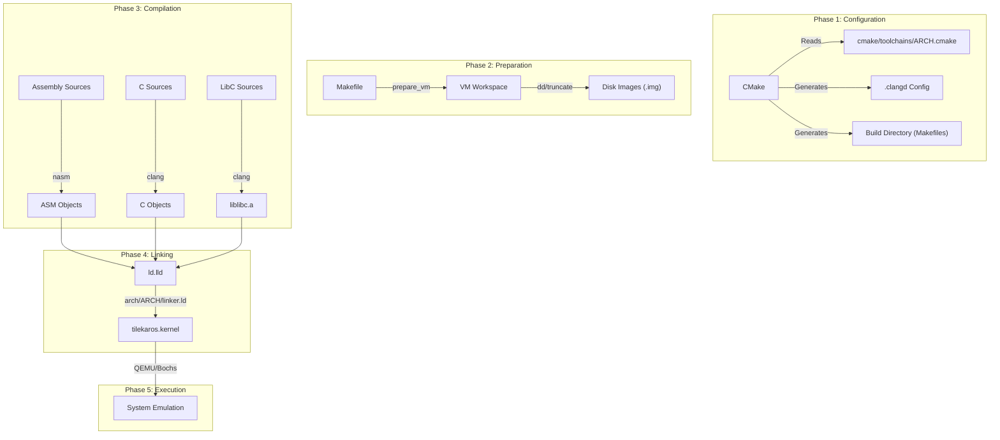

# Build System Internals & Developer Guide

This document is the definitive guide to the TilekarOS build system. It is designed for developers who need to understand, extend, or debug the compilation process.

## 1. Philosophy & Architecture

TilekarOS uses **CMake** (v3.15+) as its primary build system generator. While `Makefiles` exist in the project, they are thin wrappers (Facades) intended for user convenience (`make`, `make run`), while CMake handles the heavy lifting of dependency graph generation, compiler configuration, and cross-compilation toolchains.

### Why CMake?
*   **Cross-Platform**: Generates Makefiles, Ninja build files, or IDE projects seamlessly.
*   **Multi-Architecture**: Easy switching between architectures using toolchain files.
*   **Dependency Management**: Correctly handles complex build chains.
*   **IDE Support**: Automatically generates `.clangd` for robust IntelliSense in editors like Zed, VS Code, and CLion.

### Dynamic Workspaces & Storage
The build system features a "Workspace" concept for emulation:
*   **VM Workspaces**: Use `VM=Name` to create isolated environments for different test scenarios.
*   **Dynamic Drives**: Use `DRIVES=name:size_mb,...` to automatically generate and resize disk images for the VM.

### The Build Pipeline

The build process transforms raw C and Assembly source code into a bootable kernel or ISO image.

---

## 2. Multi-Architecture Support

The build system is designed to be **Architecture Agnostic**. The target architecture is controlled by the `OS_ARCH` variable (defaulting to `i386`).

### Toolchain Files
Located in `cmake/toolchains/`, these files define the cross-compiler, linker flags, and target triple.

---

## 3. Core Build Files

### Root `CMakeLists.txt`
The central configuration. It handles project initialization, subdirectory processing, and **automatic IDE configuration** by writing a `.clangd` file with correct include paths and flags.

### Wrapper `Makefile`
A powerful facade for daily development. It manages:
1.  **Build Orchestration**: Calls CMake to build targets.
2.  **VM Provisioning**: Automatically creates and resizes disk images based on `DRIVES` variable.
3.  **Cleaning**: Targeted cleaning of both build artifacts and VM workspaces.

---

## 4. Helper Scripts

### `helpers/h2inc.py`
Bridging C and Assembly by converting `#define` constants into NASM-compatible `%define` macros, ensuring single-source-of-truth for shared constants.

---

## 5. Command Reference

| Command | Variables | Description |
| :--- | :--- | :--- |
| `make` | `ARCH=...` | Builds kernel and libc. |
| `make run` | `VM=... DRIVES=...` | Builds and runs in QEMU with specific drives. |
| `make run_iso` | `VM=...` | Builds a bootable ISO and runs it. |
| `make run_bochs` | | Runs the kernel in the Bochs emulator. |
| `make debug_run` | | Runs in QEMU with GDB stub enabled (port 1234). |
| `make clean` | `VM=...` | Removes build files and the specified VM workspace. |

### Variables
*   `ARCH`: Target architecture (e.g., `i386`).
*   `VM`: Name of the workspace folder (default: `VirtualMachine`).
*   `DRIVES`: Comma-separated list of `name:size` (in MB). Example: `DRIVES=os:20,data:50`.

---

## 6. IDE Integration

The build system is optimized for modern editors:
*   **Clangd**: Every time you run `cmake` (or `make`), a `.clangd` file is generated at the root. This provides perfect autocomplete, "Go to Definition", and error checking.
*   **Compile Commands**: `compile_commands.json` is generated in the `build/` directory.
