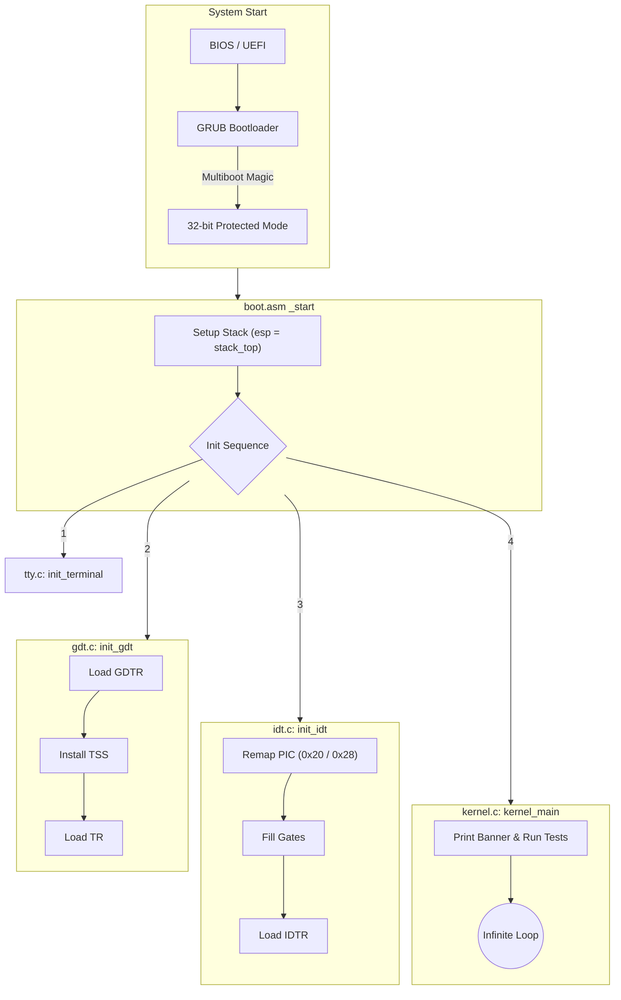
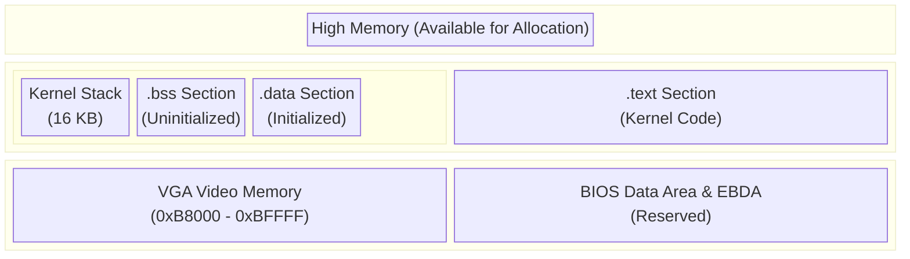
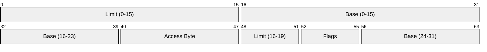
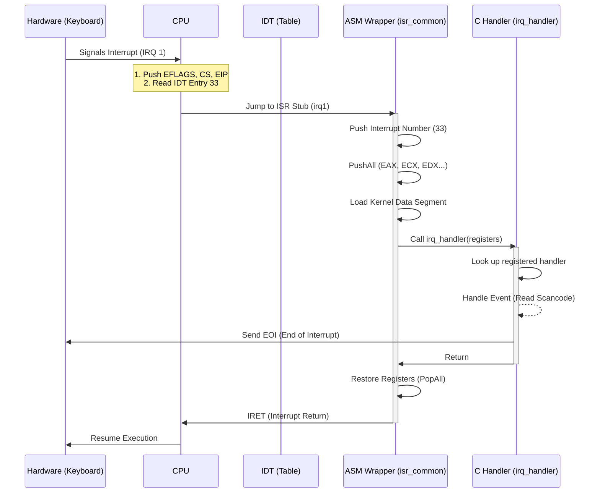

# Architecture & Internals

This document provides a deep dive into the internal architecture of TilekarOS. It covers the boot sequence, memory organization, and the interrupt handling mechanism, supported by detailed diagrams.

## 1. The Boot Sequence

The transition from a powered-off machine to the executing kernel involves several stages. TilekarOS relies on a Multiboot-compliant bootloader (like GRUB) to handle the initial hardware setup.

### Detailed Boot Flowchart

### Steps Explained

1.  **Bootloader Handoff**: GRUB ensures the CPU is in Protected Mode (A20 line enabled, Paging disabled). It places the **[Multiboot Information Structure](https://wiki.osdev.org/Multiboot)** in memory and puts the "Magic Number" in `EAX`.
2.  **Stack Setup**: Since C functions require a stack, `boot.asm` points the Stack Pointer (`ESP`) to the top of a reserved 16KiB block in the `.bss` section.
3.  **Global Descriptor Table (GDT)**: We replace the GDT provided by GRUB with our own to ensure we have full control over the memory segments and to set up the TSS (Task State Segment) for future ktask-mode switching. See [Global Descriptor Table](https://wiki.osdev.org/Global_Descriptor_Table).
4.  **Interrupt Descriptor Table (IDT)**: We configure the IDT to handle exceptions (like Divide-by-Zero) and hardware interrupts. The 8259 PIC is remapped to avoid IDT collisions. See [Interrupt Descriptor Table](https://wiki.osdev.org/Interrupt_Descriptor_Table).

---

## 2. Memory Organization

TilekarOS uses a **Flat Memory Model**. Paging is currently *disabled* (Linear Address = Physical Address). See [Memory Map (x86)](https://wiki.osdev.org/Memory_Map_(x86)).

### Memory Layout Diagram

### GDT Entry Structure

The GDT defines the characteristics of the various memory segments.

*   **Base**: The starting linear address of the segment (0x0 for Flat Model).
*   **Limit**: The size of the segment.
*   **Access Byte**: Defines presence, privilege level (Ring 0 vs 3), and type (Code vs Data).
*   **Flags**: Granularity (4KiB blocks vs 1 Byte) and Operand size (32-bit vs 16-bit).

---

## 3. Interrupt Handling System

The interrupt system allows the CPU to pause current execution to handle urgent events (Exceptions, Hardware Signals, Syscalls).

### Interrupt Dispatch Pipeline

When an interrupt (e.g., IRQ 1 - Keyboard) occurs:

### IDT Configuration

The IDT is an array of 256 8-byte entries.

| Vector Range | Usage | Description |
| :--- | :--- | :--- |
| **0 - 31** | **CPU Exceptions** | Faults, Traps, and Aborts (e.g., Page Fault, GPF). |
| **32 - 47** | **Hardware IRQs** | Remapped PIC interrupts. IRQ0=32 (Timer), IRQ1=33 (Keyboard). |
| **48 - 127** | *Reserved* | Available for custom use. |
| **128 (0x80)** | **Syscall** | Typical Linux-style system call entry point. |
| **177** | **Syscall** | Alternate system call entry point. |

### The PIC Remapping Issue
By default, the [8259 PIC](https://wiki.osdev.org/8259_PIC) maps IRQs 0-7 to Interrupt Vectors 0-7. This conflicts with CPU Exceptions (e.g., INT 0 is Divide-by-Zero).
**Solution**: We reprogram the PIC to offset IRQs to start at vector **32 (0x20)**.

*   Master PIC (IRQs 0-7) $\rightarrow$ Vectors 32-39
*   Slave PIC (IRQs 8-15) $\rightarrow$ Vectors 40-47

---

## 4. Kernel Execution & Testing

The `kernel_main` function serves as the entry point for the OS after initialization. Currently, it performs the following actions:

1.  **Banner Display**: Prints the OS welcome message using `terminal_writestring`.
2.  **Exception Test**: Intentionally triggers a **Divide-by-Zero** exception (`1/0`).
    *   **Purpose**: To verify that the IDT is correctly loaded and the ISR for Vector 0 is firing.
    *   **Expected Behavior**: The OS should catch the exception, print a debug message (if implemented), and halt or panic, rather than triple-faulting or resetting.
