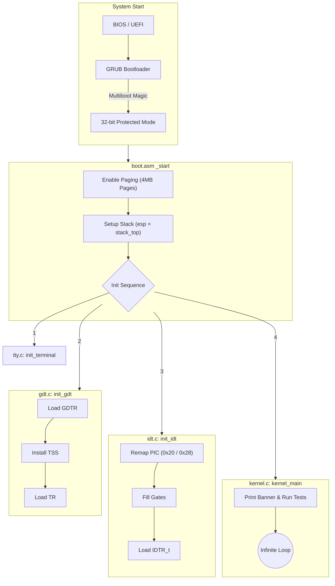

# Boot and Kernel Initialization

This document provides a deep dive into how TilekarOS transitions from the BIOS to a fully operational 32-bit higher-half kernel.

## 1. The Bootloader Handoff (GRUB)

TilekarOS is **Multiboot-compliant**, meaning it relies on a bootloader like GRUB to perform the initial hardware setup.

### The Multiboot Header
**Source File**: [boot.asm](https://github.com/SohamTilekar/TilekarOS/blob/main/kernel/arch/i386/boot/boot.asm){: target="_blank" }

GRUB looks for a specific magic number (`0x1BADB002`) within the first 8KB of the kernel binary. This header contains flags that request page alignment for modules and memory information from the bootloader.

??? example "Code Preview: `boot.asm` (Header)"
    ```nasm
    --8<-- "kernel/arch/i386/boot/boot.asm"
    ```

!!! info "OSDev Reference"
    For more on the Multiboot specification, see the [OSDev Wiki: Multiboot](https://wiki.osdev.org/Multiboot) or [Wikipedia: Multiboot](https://en.wikipedia.org/wiki/Multiboot_specification).

---

## 2. Low-Level Entry (`boot.asm`)

When GRUB jumps to the `_start` symbol, the CPU is in **32-bit Protected Mode**, but paging is disabled.

### Higher-Half Trampoline
TilekarOS is a **Higher-Half Kernel**, meaning it lives at virtual address `0xC0000000` (3GB). However, it is loaded at `0x00100000` (1MB) in physical RAM.

To bridge this gap, the entry code performs the following "trampoline" sequence:
1.  **Initial Page Directory**: It sets up a temporary page directory (`initial_page_dir`).
2.  **Identity Mapping**: It maps the first 4MB of physical memory to the first 4MB of virtual memory. This ensures the CPU doesn't crash immediately when paging is enabled.
3.  **Higher-Half Mapping**: It maps the first 16MB of physical memory to virtual `0xC0000000`.
4.  **Large Pages (4MB)**: It uses [Page Size Extensions (PSE)](https://en.wikipedia.org/wiki/Page_Size_Extension) to map 4MB blocks at once, simplifying the initial boot code.



## 3. Linker Layout (`linker.ld`)
**Source File**: [linker.ld](https://github.com/SohamTilekar/TilekarOS/blob/main/kernel/arch/i386/boot/linker.ld){: target="_blank" }

The linker script is responsible for the final organization of the binary. It defines where each section (text, data, bss) is placed in both physical and virtual memory.

??? example "Code Preview: `linker.ld`"
    ```ld
    --8<-- "kernel/arch/i386/boot/linker.ld"
    ```

!!! tip "Under the Hood: VMA vs LMA"
    The **LMA** (Load Memory Address) is where the data is actually loaded in RAM (1MB). The **VMA** (Virtual Memory Address) is where the code *expects* to be when it runs (`0xC0000000 + 1MB`). The difference between the two is handled by the initial paging setup in `boot.asm`.

---

## 4. C Initialization (`init_kernel.c`)
**Source File**: [init_kernel.c](https://github.com/SohamTilekar/TilekarOS/blob/main/kernel/arch/i386/init_kernel.c){: target="_blank" }

Once in the higher half, the `init_kernel` function orchestrates the setup of all major subsystems. It takes the multiboot magic number and the pointer to the multiboot information structure as arguments.

??? example "Code Preview: `init_kernel.c`"
    ```c
    --8<-- "kernel/arch/i386/init_kernel.c"
    ```

### Initialization Steps:
1.  **VGA/TTY**: Clears the screen and prepares for text output.
2.  **GDT & IDT**: Replaces the GRUB-provided table with our own to handle memory segments and interrupts.
3.  **Keyboard**: Initializes the PS/2 keyboard driver.
4.  **Memory Management**:
    - **PMM**: Calculates available RAM from the `boot_info` provided by GRUB.
    - **Paging**: Sets up recursive paging and removes the identity mapping.
5.  **Heap**: Initializes `kmalloc` with a 1MB pool.
6.  **PCI Scan**: Enumerate devices on the PCI bus to find IDE/ATA controllers.
7.  **Storage & Filesystem**:
    - **ATA**: Probes for hard disks and registers them in the device registry.
    - **VFS**: Registers standard I/O devices (`tty0`, `kbd0`) and mounts the root filesystem.
8.  **Multitasking**: Sets up the scheduler, the first "Main" task, and any initial user-mode processes.

---

## 5. Test/Example: Verifying Multiboot Info

You can verify that GRUB is passing correct information by checking the `MultiBootInfo` struct in `init_kernel.c`:

```c
void test_multiboot(MultiBootInfo* boot_info) {
    if (boot_info->flags & MULTIBOOT_INFO_MEMORY) {
        printf("Lower Memory: %u KB\n", boot_info->mem_lower);
        printf("Upper Memory: %u KB\n", boot_info->mem_upper);
    }
    if (boot_info->flags & MULTIBOOT_INFO_BOOT_LOADER_NAME) {
        printf("Bootloader: %s\n", (char*)boot_info->boot_loader_name + KERNEL_START);
    }
}
```

---

## References
- [OSDev: Kernel Boot Process](https://wiki.osdev.org/Kernel_Boot_Process)
- [Wikipedia: Protected Mode](https://en.wikipedia.org/wiki/Protected_mode)
- [Multiboot Specification](https://www.gnu.org/software/grub/manual/multiboot/multiboot.html)
