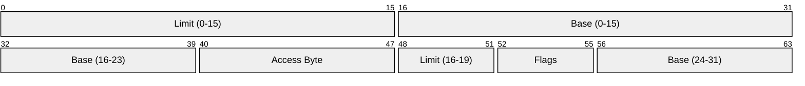
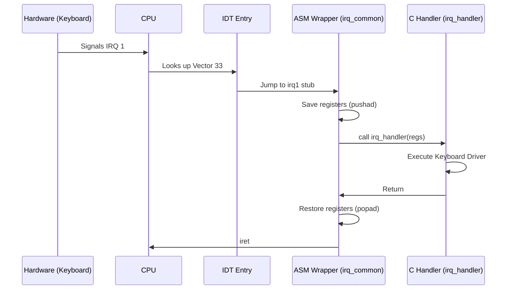

# CPU Architecture and Interrupts

TilekarOS manages the x86 processor using two fundamental structures: the **Global Descriptor Table (GDT)** and the **Interrupt Descriptor Table (IDT)**.

## 1. Global Descriptor Table (GDT)
**Source Files**: [gdt.c](https://github.com/SohamTilekar/TilekarOS/blob/main/kernel/arch/i386/cpu/gdt.c){: target="_blank" }, [gdt.asm](https://github.com/SohamTilekar/TilekarOS/blob/main/kernel/arch/i386/cpu/gdt.asm){: target="_blank" }

The GDT defines the memory segments used by the OS. TilekarOS uses a **Flat Memory Model**, where each segment starts at address 0 and covers the entire 4GB of memory.

??? example "Code Preview: `gdt.c`"
    ```c
    --8<-- "kernel/arch/i386/cpu/gdt.c"
    ```

### Segment Layout
| Selector | Usage | Base | Limit | DPL |
| :--- | :--- | :--- | :--- | :--- |
| **0x08** | Kernel Code | 0x0 | 4 GB | 0 (Ring 0) |
| **0x10** | Kernel Data | 0x0 | 4 GB | 0 (Ring 0) |
| **0x18** | User Code | 0x0 | 4 GB | 3 (Ring 3) |
| **0x20** | User Data | 0x0 | 4 GB | 3 (Ring 3) |
| **0x28** | TSS | &tss | sizeof(TSS) | 3 (Ring 3) |

#### Segment Selectors Configuration:
See [local_config.h](https://github.com/SohamTilekar/TilekarOS/blob/main/kernel/arch/i386/cpu/local_config.h){: target="_blank" } for the detailed index and offset definitions.

### GDT Entry Structure

The GDT defines the characteristics of the various memory segments.



*   **Base**: The starting linear address of the segment (0x0 for Flat Model).
*   **Limit**: The size of the segment.
*   **Access Byte**: Defines presence, privilege level (Ring 0 vs 3), and type (Code vs Data).
*   **Flags**: Granularity (4KiB blocks vs 1 Byte) and Operand size (32-bit vs 16-bit).

### Task State Segment (TSS)
The TSS is essential for **Privilege Level Switching**. When an interrupt occurs while the CPU is in Ring 3, the hardware automatically switches to the Ring 0 stack pointer (`esp0`) stored in the TSS.

!!! tip "Why we need TSS"
    Even though TilekarOS uses software-based multitasking, a single hardware TSS is required to handle the transition from User Mode back to Kernel Mode during interrupts or system calls.

---

## 2. Interrupt Descriptor Table (IDT)
**Source Files**: [idt.c](https://github.com/SohamTilekar/TilekarOS/blob/main/kernel/arch/i386/cpu/idt.c){: target="_blank" }, [idt.asm](https://github.com/SohamTilekar/TilekarOS/blob/main/kernel/arch/i386/cpu/idt.asm){: target="_blank" }

The IDT tells the CPU which code to run when an interrupt or exception occurs.

??? example "Code Preview: `idt.c`"
    ```c
    --8<-- "kernel/arch/i386/cpu/idt.c"
    ```

### Interrupt Dispatch Pipeline
When an interrupt (e.g., IRQ 1 - Keyboard) occurs, the hardware stops current execution and jumps to a specific assembly stub.



### IDT Configuration

The IDT is an array of 256 8-byte entries.

| Vector Range | Usage | Description |
| :--- | :--- | :--- |
| **0 - 31** | **CPU Exceptions** | Faults, Traps, and Aborts (e.g., Page Fault, GPF). |
| **32 - 47** | **Hardware IRQs** | Remapped PIC interrupts. IRQ0=32 (Timer), IRQ1=33 (Keyboard). |
| **48 - 127** | *Reserved* | Available for custom use. |
| **128 (0x80)** | **Syscall** | Typical Linux-style system call entry point. |
| **177** | **Syscall** | Alternate system call entry point. |

### PIC Remapping
The [8259 PIC](https://wiki.osdev.org/8259_PIC) is remapped so that hardware interrupts (IRQs) start at vector **32 (0x20)**, avoiding conflicts with CPU exceptions (0-31).

---

## 3. Kernel Utility Functions
**Source File**: [utils.h](https://github.com/SohamTilekar/TilekarOS/blob/main/kernel/arch/i386/utils/utils.h){: target="_blank" }

TilekarOS provides low-level functions for direct hardware interaction:

- **`out_port_b(port, value)`**: Writes a byte to an I/O port.
- **`in_port_b(port)`**: Reads a byte from an I/O port.
- **`interrupt_save()` / `interrupt_restore()`**: Atomically disable/enable interrupts using `cli` and `sti`, preserving the current state of the `EFLAGS` register.

??? example "Code Preview: `utils.h`"
    ```c
    --8<-- "kernel/arch/i386/utils/utils.h"
    ```

---

## 4. Test/Example: Triggering a Soft Exception

You can test the IDT by triggering a manual software interrupt or an exception:

```c
void test_interrupts() {
    // 1. Division by zero (Should trigger ISR 0)
    volatile int x = 5 / 0; 

    // 2. Breakpoint (Should trigger ISR 3)
    asm volatile("int3");

    // 3. System Call (Should trigger ISR 128 / 0x80)
    asm volatile("int $0x80" : : "a"(0)); // SYS_EXIT
}
```

---

## References
- [OSDev: GDT](https://wiki.osdev.org/Global_Descriptor_Table)
- [OSDev: IDT](https://wiki.osdev.org/Interrupt_Descriptor_Table)
- [Wikipedia: x86 Interrupts](https://en.wikipedia.org/wiki/Interrupt)
- [Wikipedia: TSS](https://en.wikipedia.org/wiki/Task_state_segment)
- [Wikipedia: GDT](https://en.wikipedia.org/wiki/Global_Descriptor_Table)
