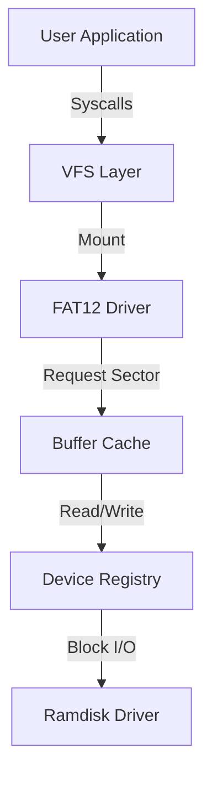

# Storage and Filesystem Stack

TilekarOS features a modular storage stack that abstracts hardware details from the application layer. This allows the same code to work with ramdisks, hard drives, or network storage.

## 1. The Modular Architecture
TilekarOS uses a tiered approach to storage:

| Layer | Component | Description |
| :--- | :--- | :--- |
| **High** | **VFS** ([vfs.c](https://github.com/SohamTilekar/TilekarOS/blob/main/kernel/arch/i386/fs/vfs.c){: target="_blank" }) | Virtual File System (Abstracts FAT, Ext2, etc.) |
| | **FAT** ([fat.c](https://github.com/SohamTilekar/TilekarOS/blob/main/kernel/arch/i386/fs/fat.c){: target="_blank" }) | File Allocation Table (FAT12 implementation) |
| | **Buffer Cache** ([buffer.c](https://github.com/SohamTilekar/TilekarOS/blob/main/kernel/arch/i386/fs/buffer.c){: target="_blank" }) | Caches disk sectors in RAM to speed up I/O |
| **Low** | **Device Layer** ([devices.c](https://github.com/SohamTilekar/TilekarOS/blob/main/kernel/arch/i386/drivers/devices.c){: target="_blank" }) | Unified interface for Block/Char hardware |
| | **Drivers** ([ramdisk.c](https://github.com/SohamTilekar/TilekarOS/blob/main/kernel/arch/i386/drivers/ramdisk.c){: target="_blank" }) | Hardware-specific code |



---

## 2. Virtual File System (VFS)
**Source Files**: [vfs.c](https://github.com/SohamTilekar/TilekarOS/blob/main/kernel/arch/i386/fs/vfs.c){: target="_blank" }, [vfs.h](https://github.com/SohamTilekar/TilekarOS/blob/main/kernel/arch/i386/fs/vfs.h){: target="_blank" }

The VFS provides a common interface for file operations like `open`, `read`, and `write`.

??? example "Code Preview: `vfs.h`"
    ```c
    --8<-- "kernel/arch/i386/fs/vfs.h"
    ```

### Key Concepts:
- **`vnode_t`**: Represents a file or directory on any filesystem.
- **`file_t`**: Represents an open instance of a file (contains current seek position).
- **Mounting**: Attaching a filesystem driver to a specific path (e.g., mounting the ramdisk to `/`).

---

## 3. FAT12 Filesystem
**Source Files**: [fat.c](https://github.com/SohamTilekar/TilekarOS/blob/main/kernel/arch/i386/fs/fat.c){: target="_blank" }, [fat.h](https://github.com/SohamTilekar/TilekarOS/blob/main/kernel/arch/i386/fs/fat.h){: target="_blank" }

TilekarOS includes a native **FAT12** driver, commonly used for floppy disks and ramdisks.

### Implementation Details:
- **BPB (BIOS Parameter Block)**: Parsed from the first sector to get cluster size and FAT location.
- **Cluster Chains**: Follows the FAT table to read files spanning multiple non-contiguous clusters.
- **8.3 Filenames**: Supports standard short filenames (e.g., `README.TXT`).

??? example "Code Preview: `fat.h`"
    ```c
    --8<-- "kernel/arch/i386/fs/fat.h"
    ```

!!! info "OSDev Reference"
    For technical specs on the FAT format, see [OSDev: FAT](https://wiki.osdev.org/FAT).

---

## 4. Buffer Cache
**Source Files**: [buffer.c](https://github.com/SohamTilekar/TilekarOS/blob/main/kernel/arch/i386/fs/buffer.c){: target="_blank" }, [buffer.h](https://github.com/SohamTilekar/TilekarOS/blob/main/kernel/arch/i386/fs/buffer.h){: target="_blank" }

The Buffer Cache (`buffer_t`) reduces physical I/O by keeping recently accessed sectors in memory. If a sector is "dirty" (modified), it is only written back to disk when `buffer_flush()` is called or the system shuts down.

??? example "Code Preview: `buffer.h`"
    ```c
    --8<-- "kernel/arch/i386/fs/buffer.h"
    ```

---

## 5. Storage Initialization
The kernel initializes a **Ramdisk** at boot to serve as the root filesystem.

Check the initialization sequence in [kernel.c](https://github.com/SohamTilekar/TilekarOS/blob/main/kernel/kernel.c){: target="_blank" }.

??? example "Code Preview: `kernel.c` (Storage Init)"
    ```c
    --8<-- "kernel/kernel.c"
    ```

1.  **Ramdisk Allocation**: A 1.44MB buffer is allocated using `kmalloc`.
2.  **Formatting**: The ramdisk is formatted as a **FAT12** volume labeled "TILEKAROS".
3.  **VFS Mount**: The FAT12 driver is mounted at the root (`/`) of the VFS.
4.  **Initial Contents**: The kernel creates a `/BIN` directory and a sample file `/BIN/HELLO.TXT`.

---

## 6. Test/Example: Reading a file from VFS

This code demonstrates how to use the high-level VFS API within the kernel:

```c
void demo_filesystem() {
    int fd = vfs_open("/BIN/HELLO.TXT", 0);
    if (fd >= 0) {
        char buffer[64];
        int bytes = vfs_read(fd, buffer, 63);
        buffer[bytes] = '\0';
        printf("File Content: %s\n", buffer);
        vfs_close(fd);
    }
}
```

---

## References
- [OSDev: FAT](https://wiki.osdev.org/FAT)
- [OSDev: VFS](https://wiki.osdev.org/VFS)
- [Wikipedia: FAT](https://en.wikipedia.org/wiki/File_Allocation_Table)
- [Wikipedia: Virtual File System](https://en.wikipedia.org/wiki/Virtual_file_system)
