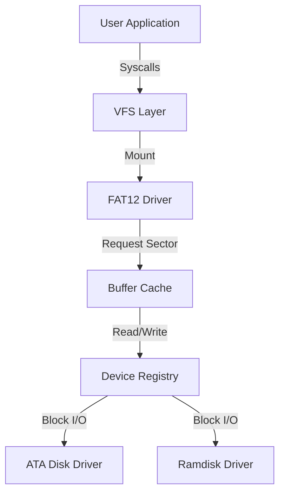

# Storage and Filesystem Stack

TilekarOS features a modular storage stack that abstracts hardware details from the application layer. This allows the same code to work with ramdisks, hard drives, or network storage.

## 1. The Modular Architecture
TilekarOS uses a tiered approach to storage:

| Layer | Component | Description |
| :--- | :--- | :--- |
| **High** | **VFS** ([vfs.c](https://github.com/SohamTilekar/TilekarOS/blob/main/kernel/arch/i386/fs/vfs.c){: target="_blank" }) | Virtual File System (Abstracts FAT, Ext2, etc.) |
| | **FAT** ([fat.c](https://github.com/SohamTilekar/TilekarOS/blob/main/kernel/arch/i386/fs/fat.c){: target="_blank" }) | File Allocation Table (FAT12 implementation) |
| | **Buffer Cache** ([buffer.c](https://github.com/SohamTilekar/TilekarOS/blob/main/kernel/arch/i386/fs/buffer.c){: target="_blank" }) | Caches disk sectors in RAM to speed up I/O |
| **Low** | **Device Layer** ([devices.c](https://github.com/SohamTilekar/TilekarOS/blob/main/kernel/arch/i386/drivers/devices.c){: target="_blank" }) | Unified interface for Block/Char hardware |
| | **Drivers** ([ata.c](https://github.com/SohamTilekar/TilekarOS/blob/main/kernel/arch/i386/drivers/ata.c){: target="_blank" }, [ramdisk.c](https://github.com/SohamTilekar/TilekarOS/blob/main/kernel/arch/i386/drivers/ramdisk.c){: target="_blank" }) | Hardware-specific code (Supports **PIO** and **DMA**) |



---

## 2. Virtual File System (VFS)
**Source Files**: [vfs.c](https://github.com/SohamTilekar/TilekarOS/blob/main/kernel/arch/i386/fs/vfs.c){: target="_blank" }, [vfs.h](https://github.com/SohamTilekar/TilekarOS/blob/main/kernel/arch/i386/fs/vfs.h){: target="_blank" }

The VFS provides a common interface for file operations like `open`, `read`, and `write`.

### Key Concepts:
- **`vnode_t`**: Represents a file or directory on any filesystem.
- **`file_t`**: Represents an open instance of a file (contains current seek position).
- **Mounting**: Attaching a filesystem driver to a specific path.

---

## 3. FAT12 Filesystem
**Source Files**: [fat.c](https://github.com/SohamTilekar/TilekarOS/blob/main/kernel/arch/i386/fs/fat.c){: target="_blank" }, [fat.h](https://github.com/SohamTilekar/TilekarOS/blob/main/kernel/arch/i386/fs/fat.h){: target="_blank" }

TilekarOS includes a native **FAT12** driver, which supports both read and write operations.

### Implementation Details:
- **BPB (BIOS Parameter Block)**: Parsed from the first sector to get cluster size and FAT location.
- **Cluster Chains**: Follows the FAT table to read files spanning multiple non-contiguous clusters.
- **8.3 Filenames**: Supports standard short filenames (e.g., `README.TXT`).
- **Directory Management**: Supports `mkdir`, `rmdir`, and `readdir` operations.

---

## 4. Buffer Cache
**Source Files**: [buffer.c](https://github.com/SohamTilekar/TilekarOS/blob/main/kernel/arch/i386/fs/buffer.c){: target="_blank" }, [buffer.h](https://github.com/SohamTilekar/TilekarOS/blob/main/kernel/arch/i386/fs/buffer.h){: target="_blank" }

The Buffer Cache (`buffer_t`) reduces physical I/O by keeping recently accessed sectors in memory. If a sector is "dirty" (modified), it is only written back to disk when `buffer_flush()` is called or the system shuts down.

---

## 5. Storage Initialization
The kernel initializes available storage devices at boot.

1.  **PCI Scan**: The kernel scans the PCI bus to find IDE/ATA controllers.
2.  **ATA Discovery**: For each controller found, the kernel probes for connected Master/Slave drives.
3.  **Device Registration**: Disks are registered in the device registry (e.g., `ata0`, `ata1`).
4.  **VFS Mount**: The boot partition (usually on `ata0`) is mounted at the root (`/`) of the VFS.

---

## 6. Test/Example: Reading a file from VFS

This code demonstrates how to use the high-level VFS API within the kernel:

```c
void demo_filesystem() {
    int fd = vfs_open("/BIN/HELLO.TXT", 0);
    if (fd >= 0) {
        char buffer[64];
        int bytes = vfs_read(fd, buffer, 63);
        buffer[bytes] = '\0';
        printf("File Content: %s\n", buffer);
        vfs_close(fd);
    }
}
```

---

## References
- [OSDev: FAT](https://wiki.osdev.org/FAT)
- [OSDev: VFS](https://wiki.osdev.org/VFS)
- [OSDev: ATA](https://wiki.osdev.org/ATA_PIO_Mode)
