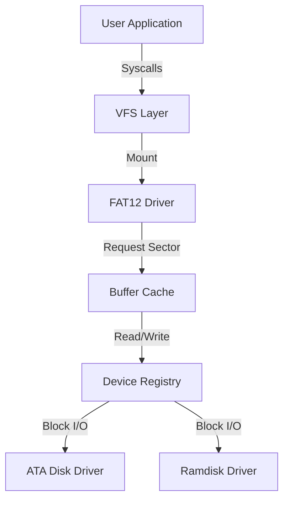

# Storage and Filesystem Stack

TilekarOS features a modular storage stack that abstracts hardware details from the application layer. This allows the same code to work with ramdisks, hard drives, or network storage.

## 1. The Modular Architecture
TilekarOS uses a tiered approach to storage:

| Layer | Component | Description |
| :--- | :--- | :--- |
| **High** | **VFS** ([vfs.c](https://github.com/SohamTilekar/TilekarOS/blob/main/kernel/arch/i386/fs/vfs.c){: target="_blank" }) | Virtual File System (Abstracts FAT, Ext2, etc.) |
| | **FAT** ([fat.c](https://github.com/SohamTilekar/TilekarOS/blob/main/kernel/arch/i386/fs/fat.c){: target="_blank" }) | File Allocation Table (FAT12 implementation) |
| | **Buffer Cache** ([buffer.c](https://github.com/SohamTilekar/TilekarOS/blob/main/kernel/arch/i386/fs/buffer.c){: target="_blank" }) | Caches disk sectors in RAM to speed up I/O |
| **Low** | **Device Layer** ([devices.c](https://github.com/SohamTilekar/TilekarOS/blob/main/kernel/arch/i386/drivers/devices.c){: target="_blank" }) | Unified interface for Block/Char hardware |
| | **Drivers** ([ata.c](https://github.com/SohamTilekar/TilekarOS/blob/main/kernel/arch/i386/drivers/ata.c){: target="_blank" }, [ramdisk.c](https://github.com/SohamTilekar/TilekarOS/blob/main/kernel/arch/i386/drivers/ramdisk.c){: target="_blank" }) | Hardware-specific code (Supports **PIO** and **DMA**) |



---

## 2. Virtual File System (VFS)
**Source Files**: [vfs.c](https://github.com/SohamTilekar/TilekarOS/blob/main/kernel/arch/i386/fs/vfs.c){: target="_blank" }, [vfs.h](https://github.com/SohamTilekar/TilekarOS/blob/main/kernel/arch/i386/fs/vfs.h){: target="_blank" }

The VFS provides a common interface for file operations like `open`, `read`, `write`, and `create`, abstracting the underlying filesystem (FAT12, Ext2, etc.).

### Core Data Structures

#### `vnode_t` - Virtual Node
Represents a file or directory on any filesystem:
```c
typedef struct vnode {
    char name[256];
    uint32_t size;
    uint8_t type;           // VNODE_TYPE_FILE or VNODE_TYPE_DIR
    void* fs_node;          // Pointer to filesystem-specific data (FAT entry, inode, etc.)
    struct fs_driver* fs;   // Pointer to filesystem driver (FAT, Ext2, etc.)
} vnode_t;
```

#### `file_t` - Open File Handle
Represents an open instance of a file:
```c
typedef struct file {
    vnode_t* vnode;
    uint32_t offset;        // Current read/write position
    uint32_t flags;         // O_RDONLY, O_WRONLY, O_RDWR, etc.
} file_t;
```

### VFS Operations

#### File Access

##### `vfs_open(path, flags)`
Opens a file by path.
- **Parameters**: Path string, access flags
- **Returns**: File descriptor (fd) or negative error code
- **Behavior**: Traverses path, loads vnode, creates file_t handle

##### `vfs_read(fd, buf, size)`
Reads from file at current offset.
- **Parameters**: File descriptor, buffer, bytes to read
- **Returns**: Bytes read or negative error code
- **Behavior**: Updates offset after read

##### `vfs_write(fd, buf, size)`
Writes to file at current offset.
- **Parameters**: File descriptor, buffer, bytes to write
- **Returns**: Bytes written or negative error code
- **Behavior**: Updates offset, may extend file size

##### `vfs_close(fd)`
Closes file descriptor.
- **Parameters**: File descriptor
- **Returns**: 0 on success, negative error code on failure

#### Directory Operations

##### `vfs_mkdir(path)`
Creates a directory.
- **Parameters**: Directory path
- **Returns**: 0 on success, negative error code on failure

##### `vfs_rmdir(path)`
Removes an empty directory.
- **Parameters**: Directory path
- **Returns**: 0 on success, negative error code on failure

##### `vfs_readdir(fd, index, buf)`
Reads directory entries.
- **Parameters**: Directory fd, entry index, output buffer
- **Returns**: 0 on success, -1 when no more entries, negative error code on failure

#### File Management

##### `vfs_unlink(path)`
Deletes a file.
- **Parameters**: File path
- **Returns**: 0 on success, negative error code on failure

##### `vfs_create(path, mode)`
Creates a new file.
- **Parameters**: File path, file mode/attributes
- **Returns**: File descriptor or negative error code

### Path Traversal
VFS translates absolute paths into vnode lookups:
1. Split path into components: `/DIR1/DIR2/FILE.TXT` → `["DIR1", "DIR2", "FILE.TXT"]`
2. Start at root vnode
3. For each component: call filesystem's `lookup` function
4. Return final vnode

### Mounting
Filesystems are mounted at specific paths:
- `/` → FAT12 partition on ata0
- `/dev` → Device filesystem
- `/proc` → Process information (virtual)

### Error Handling
VFS syscalls return negative error codes:
- `-ENOENT`: File or directory not found
- `-EEXIST`: File already exists
- `-EISDIR`: Expected file but got directory
- `-ENOTDIR`: Expected directory but got file
- `-EACCES`: Permission denied
- `-EIO`: I/O error

## 3. FAT12 Filesystem
**Source Files**: [fat.c](https://github.com/SohamTilekar/TilekarOS/blob/main/kernel/arch/i386/fs/fat.c){: target="_blank" }, [fat.h](https://github.com/SohamTilekar/TilekarOS/blob/main/kernel/arch/i386/fs/fat.h){: target="_blank" }

TilekarOS includes a native **FAT12** driver with comprehensive read and write support.

### Supported Features:
- **Read Operations**: Full FAT12 file reading with cluster chain traversal
- **Write Operations**: Create files, write data, extend files
- **Directory Operations**: Create directories (`mkdir`), remove empty directories (`rmdir`)
- **Long File Names (LFN)**: Extended filename support beyond 8.3 format
- **Persistence**: All operations persist to disk via buffer cache

### Implementation Details:

#### BIOS Parameter Block (BPB)
Parsed from the first sector to determine:
- Cluster size (typically 512, 1024, or 2048 bytes)
- FAT location and size
- Root directory location and entry count
- Total sectors and media type

#### File Allocation Table (FAT)
- Linked list of clusters forming file chains
- Each entry points to the next cluster in a file
- Special values: `0x000` (free), `0xFF8-0xFFF` (EOF), `0xFF7` (bad cluster)
- FAT is replicated (at least 2 copies) for redundancy

#### Cluster Chains
Reads files by:
1. Finding file's starting cluster in directory entry
2. Following FAT chain: cluster → FAT[cluster] → next cluster → ...
3. Reading each cluster's data until EOF marker reached

#### Directory Entries
Each directory entry (32 bytes) contains:
- **Name**: 8.3 format (padded with spaces)
- **Attributes**: Read-only, Hidden, System, Archive, Directory, Volume ID
- **Timestamps**: Creation, modification, access dates
- **Starting Cluster**: First cluster of file/directory
- **File Size**: Bytes (0 for directories)

#### Write Operations

##### Creating Files
```c
int fat_create(const char* path, uint8_t attributes);
```
1. Parse path to find parent directory
2. Find free cluster via FAT scan
3. Add directory entry to parent
4. Mark cluster chain in FAT
5. Flush to disk

##### Writing Data
```c
int fat_write(uint32_t start_cluster, const void* buf, uint32_t size);
```
1. Allocate clusters from FAT as needed
2. Write data to clusters
3. Update file size in directory entry
4. Mark buffers dirty for flushing

##### Directory Creation
```c
int fat_mkdir(const char* path);
```
1. Allocate cluster for new directory
2. Create `.` and `..` entries
3. Add directory entry to parent
4. Mark cluster in FAT

##### Directory Removal
```c
int fat_rmdir(const char* path);
```
1. Verify directory is empty (only `.` and `..` entries)
2. Free allocated cluster
3. Remove directory entry from parent
4. Update FAT table

#### Long File Name (LFN) Support
LFN extends the 8.3 limit by using multiple consecutive directory entries:
- VFAT LFN entries precede the standard DOS 8.3 entry
- Each LFN entry stores ~13 Unicode characters
- Checksum validates LFN matches DOS name

**Example**: `MyLongDocument.txt` 
- Stored as multiple LFN entries + one DOS entry (`MYLONG~1.TXT`)

---

## 4. Buffer Cache
**Source Files**: [buffer.c](https://github.com/SohamTilekarOS/TilekarOS/blob/main/kernel/arch/i386/fs/buffer.c){: target="_blank" }, [buffer.h](https://github.com/SohamTilekar/TilekarOS/blob/main/kernel/arch/i386/fs/buffer.h){: target="_blank" }

The Buffer Cache (`buffer_t`) reduces physical I/O by keeping recently accessed sectors in memory.

### Cache Structure
```c
typedef struct buffer {
    uint32_t sector;        // Disk sector number
    uint8_t data[512];      // Sector data (typically 512 bytes)
    uint8_t dirty;          // Modified flag (needs write-back)
    uint32_t use_count;     // Reference counting for LRU
} buffer_t;
```

### Cache Operations

#### `buffer_read(dev, sector)`
Fetches a sector, using cache if available:
1. Check if sector is cached
2. If yes: increment use_count, return cached buffer
3. If no: read from disk, add to cache
4. Return buffer

#### `buffer_write(buf, data)`
Writes data to a buffer:
1. Copy data to buffer
2. Mark buffer as dirty
3. Increment use_count

#### `buffer_flush()`
Writes all dirty buffers back to disk:
1. Iterate cached buffers
2. For each dirty buffer: write to disk, clear dirty flag
3. Called at sync points and shutdown

### LRU Eviction
When cache is full:
1. Find buffer with lowest use_count
2. If dirty, flush to disk first
3. Deallocate and reuse for new sector

### Benefits
- **Speed**: Cached sectors accessed in nanoseconds vs milliseconds for disk I/O
- **Write Coalescing**: Multiple writes to same sector combined into single disk write
- **Reduced I/O**: Frequently accessed sectors stay in cache

---

## 5. Device Layer and Drivers

### Device Registry
Provides unified interface for block devices:
```c
typedef struct block_device {
    char name[32];          // "ata0", "ata1", etc.
    uint32_t block_size;    // Usually 512 bytes
    uint64_t num_blocks;    // Total blocks on device
    int (*read)(uint64_t block, uint8_t* buf);
    int (*write)(uint64_t block, const uint8_t* buf);
} block_device_t;
```

### ATA Driver
Supports IDE/ATA hard drives with two access modes:

#### PIO Mode (Programmed I/O)
- CPU controls every byte of I/O
- Slower but works on all hardware
- Used for initialization and fallback

#### DMA Mode (Direct Memory Access)
- Hardware transfers data directly to/from RAM
- Much faster (typically 2-3x)
- Requires physical addresses (obtained via `memory_get_phys()`)

#### ATA Operations
```c
int ata_read(uint64_t lba, uint8_t* buf);      // Read LBA sector to buffer
int ata_write(uint64_t lba, const uint8_t* buf); // Write buffer to LBA sector
int ata_identify(int drive);                    // Query drive information
```

### Ramdisk Driver
Virtual block device backed by RAM:
- Located in memory at `0x60000000` (configurable)
- Useful for testing and fast temporary storage
- Loses data on reboot
- Supports both read and write

---

## 6. Storage Initialization Sequence

At boot, the kernel:

1. **PCI Scan**
   - Enumerate PCI bus for IDE/ATA controllers
   - Found controllers initialized and registered

2. **ATA Probe**
   - For each controller: probe Master and Slave drives
   - Send IDENTIFY command to detect drive presence
   - Read drive capacity and capabilities

3. **Device Registration**
   - Register disks: `ata0` (Primary Master), `ata1` (Primary Slave), etc.
   - Each device registered in device registry

4. **VFS Mount**
   - Mount FAT12 filesystem from `ata0` at `/`
   - Optional: Mount additional partitions or ramdisk

5. **Boot Complete**
   - Kernel ready to execute userspace programs

### Boot Sector Reading
The bootloader loads the kernel from the first sectors of the disk:
1. BIOS reads MBR (Master Boot Record) into RAM
2. Bootcode loads kernel from known sectors
3. Bootloader jumps to kernel entry point

---

## 7. Examples and Usage

### Example 1: Reading a File from Userspace

```c
#include <unistd.h>
#include <stdio.h>

int main() {
    // Open file
    int fd = open("/README.TXT", 0);
    if (fd < 0) {
        printf("Failed to open: %d\n", fd);
        return 1;
    }
    
    // Read content
    char buffer[256];
    int bytes = read(fd, buffer, sizeof(buffer) - 1);
    if (bytes > 0) {
        buffer[bytes] = '\0';
        printf("File content:\n%s\n", buffer);
    }
    
    close(fd);
    return 0;
}
```

### Example 2: Creating and Writing Files

```c
#include <unistd.h>
#include <stdio.h>
#include <string.h>

int main() {
    // Create directory
    int ret = mkdir("/DATA");
    if (ret < 0 && ret != -17) {  // -17 = EEXIST
        printf("mkdir failed: %d\n", ret);
        return 1;
    }
    
    // Create file by opening
    int fd = open("/DATA/OUTPUT.TXT", 0);
    if (fd < 0) {
        printf("Failed to create file: %d\n", fd);
        return 1;
    }
    
    // Write data
    const char* data = "Hello from TilekarOS!\nThis is a test file.";
    int written = write(fd, data, strlen(data));
    printf("Wrote %d bytes\n", written);
    
    close(fd);
    return 0;
}
```

### Example 3: Listing Directory Contents

```c
#include <unistd.h>
#include <stdio.h>

typedef struct {
    char name[256];
    uint32_t size;
    uint8_t type;
} vfs_dirent_t;

int main() {
    // Open root directory
    int fd = open("/", 0);
    if (fd < 0) {
        printf("Failed to open /\n");
        return 1;
    }
    
    // List entries
    vfs_dirent_t entry;
    printf("Directory listing:\n");
    for (int i = 0; readdir(fd, i, &entry) == 0; i++) {
        char type_str = (entry.type == 1) ? 'D' : 'F';  // D=dir, F=file
        printf("  [%c] %s (%u bytes)\n", type_str, entry.name, entry.size);
    }
    
    close(fd);
    return 0;
}
```

### Example 4: Kernel-Level VFS Usage

```c
void demo_filesystem() {
    // Open and read file
    int fd = vfs_open("/BIN/HELLO.TXT", 0);
    if (fd >= 0) {
        char buffer[64];
        int bytes = vfs_read(fd, buffer, 63);
        buffer[bytes] = '\0';
        printf("File Content: %s\n", buffer);
        vfs_close(fd);
    }
    
    // Create directory
    int ret = vfs_mkdir("/MYDIR");
    if (ret == 0) {
        printf("Directory created\n");
    }
    
    // List directory
    fd = vfs_open("/", 0);
    if (fd >= 0) {
        vfs_dirent_t entry;
        for (int i = 0; vfs_readdir(fd, i, &entry) == 0; i++) {
            printf("Entry: %s\n", entry.name);
        }
        vfs_close(fd);
    }
}
```

---

## 8. References
- [OSDev: FAT](https://wiki.osdev.org/FAT)
- [OSDev: VFS](https://wiki.osdev.org/VFS)
- [OSDev: ATA PIO Mode](https://wiki.osdev.org/ATA_PIO_Mode)
- [OSDev: ATA DMA Mode](https://wiki.osdev.org/ATA_DMA)
- [Microsoft: FAT32 Specification](https://en.wikipedia.org/wiki/File_Allocation_Table)
- [VFAT LFN Specification](https://en.wikipedia.org/wiki/Long_filename)
- [OSDev: FAT](https://wiki.osdev.org/FAT)
- [OSDev: VFS](https://wiki.osdev.org/VFS)
- [OSDev: ATA](https://wiki.osdev.org/ATA_PIO_Mode)
