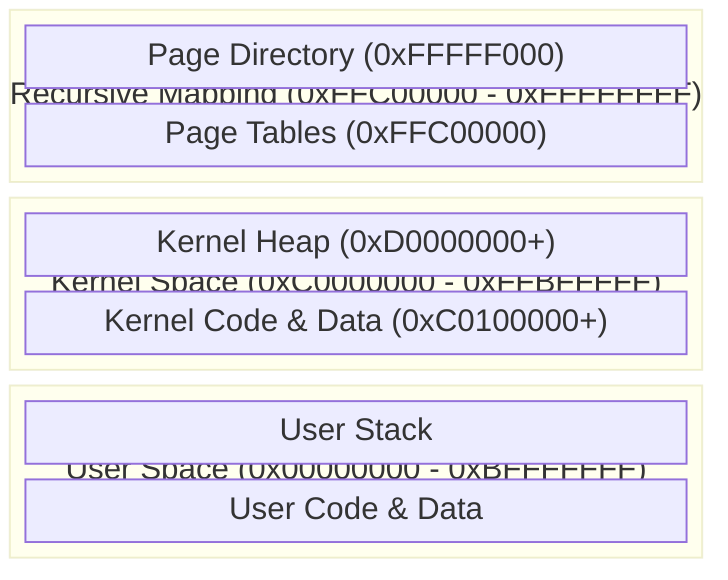
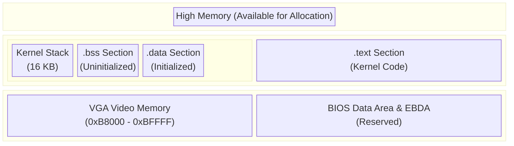
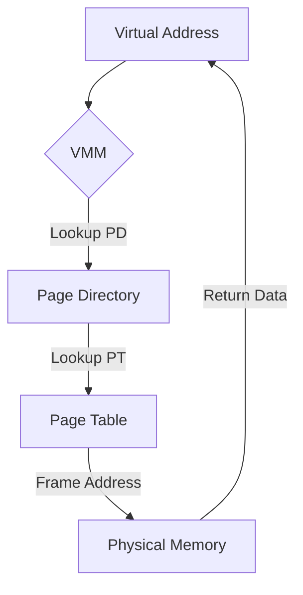

# Memory Management Deep Dive

This guide explains TilekarOS's three-layered memory management stack, spanning from physical hardware frames to user-space heap allocation.

## 1. Physical Memory Manager (PMM)
**Source File**: [memory.c](https://github.com/SohamTilekar/TilekarOS/blob/main/kernel/arch/i386/mm/memory.c){: target="_blank" }

The PMM is the lowest layer of memory management. It treats the entire 4GB RAM as a series of 4KB "frames."

### Bitmap-Based Allocation
TilekarOS uses a **Bitmap** (`physical_memory_bitmap`) to track free frames. Each bit represents one 4KB frame:
- **0**: Free
- **1**: Allocated

??? example "Code Preview: `memory.c` (PMM Implementation)"
    ```c
    --8<-- "kernel/arch/i386/mm/memory.c"
    ```

!!! tip "Why we use a bitmap"
    A bitmap is memory-efficient and easy to implement. For 4GB of RAM, the bitmap only takes **128 KB** of space.

---

## 2. Virtual Memory Manager (VMM) & Paging
**Source File**: [memory.c](https://github.com/SohamTilekar/TilekarOS/blob/main/kernel/arch/i386/mm/memory.c){: target="_blank" }

The VMM manages **32-bit Paging**, allowing the kernel to map virtual addresses to physical ones.

### Higher-Half Memory Layout



### Memory Layout Details



### Recursive Paging
TilekarOS implements **Recursive Mapping** for its Page Directory. The very last entry in the Page Directory (index 1023) points back to the Page Directory itself. See [memory.h](https://github.com/SohamTilekar/TilekarOS/blob/main/kernel/arch/i386/mm/memory.h){: target="_blank" } for the relevant constants.

This trick allows the kernel to access and modify page tables using special virtual addresses without needing to constantly map and unmap them.

- **`RECURSIVE_PAGE_DIR`**: `0xFFFFF000`
- **`RECURSIVE_PAGE_TABLE(i)`**: `0xFFC00000 + (i << 12)`



### Physical Address Translation
The kernel provides a `memory_get_phys(uintptr_t vaddr)` function. This is critical for **DMA** and low-level drivers that need to provide the actual physical memory addresses to hardware devices like the ATA controller.

!!! info "OSDev Reference"
    For details on recursive mapping, see [OSDev: Recursive Paging](https://wiki.osdev.org/Recursive_Paging).

---

## 3. Kernel Heap (`kmalloc`)
**Source File**: [kmalloc.c](https://github.com/SohamTilekar/TilekarOS/blob/main/kernel/arch/i386/mm/kmalloc.c){: target="_blank" }

The heap provides dynamic allocation for kernel objects using a **First-Fit Linked List** strategy.

### Allocation Process (`kmalloc`):
1.  **First-Fit Search**: Scans the `block_header_t` list for a free block that is large enough.
2.  **Splitting**: If a block is much larger than requested, it is split into two, leaving the remainder free.
3.  **Heap Extension (`heap_sbrk`)**: If no suitable block is found, `kmalloc` requests more physical frames from the PMM and maps them into the virtual heap space (`0xD0000000`).

??? example "Code Preview: `kmalloc.c`"
    ```c
    --8<-- "kernel/arch/i386/mm/kmalloc.c"
    ```

### Deallocation (`kfree`):
- **Coalescing**: When a block is freed, it is merged with its neighbors (if they are also free) to reduce fragmentation.

---

## 4. Test/Example: Stress-Testing the Heap

You can verify the heap's correctness by allocating large chunks and then freeing them to ensure coalescing works:

```c
void test_heap() {
    // 1. Allocate 100 small chunks
    void* ptrs[100];
    for (int i = 0; i < 100; i++) {
        ptrs[i] = kmalloc(64);
    }

    // 2. Free alternating chunks (Creating gaps)
    for (int i = 0; i < 100; i += 2) {
        kfree(ptrs[i]);
    }

    // 3. Allocate a larger chunk (Should trigger coalescing)
    void* big = kmalloc(512);
    kfree(big);

    // 4. Free the rest
    for (int i = 1; i < 100; i += 2) {
        kfree(ptrs[i]);
    }
}
```

---

## References
- [OSDev: Paging](https://wiki.osdev.org/Paging)
- [OSDev: Physical Memory Manager](https://wiki.osdev.org/Physical_Memory_Manager)
- [Wikipedia: Memory Management Unit](https://en.wikipedia.org/wiki/Memory_management_unit)
- [Wikipedia: C Dynamic Memory Allocation](https://en.wikipedia.org/wiki/C_dynamic_memory_allocation)
- [Wikipedia: Paging](https://en.wikipedia.org/wiki/Paging)
