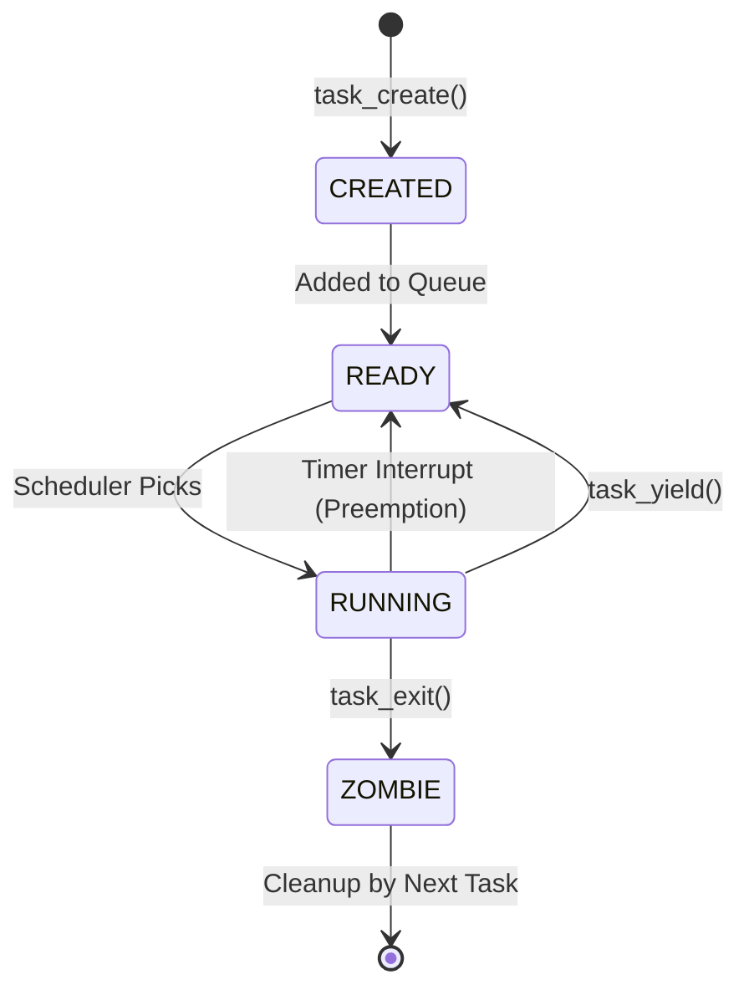
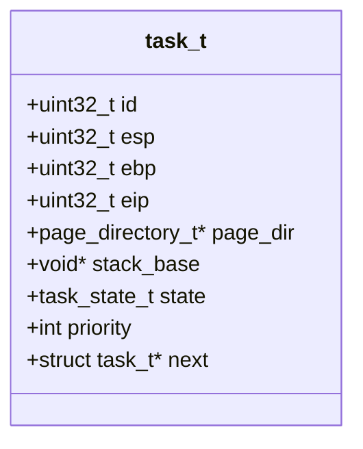

# Multitasking and Executables

TilekarOS supports **Preemptive Multitasking** for both Ring 0 (Kernel) and Ring 3 (User) tasks. This guide details how tasks are created, scheduled, and how ELF binaries are loaded.

## 1. Task Management
**Source Files**: [task.c](https://github.com/SohamTilekar/TilekarOS/blob/main/kernel/arch/i386/task/task.c){: target="_blank" }, [task.h](https://github.com/SohamTilekar/TilekarOS/blob/main/kernel/arch/i386/task/task.h){: target="_blank" }

Each process in TilekarOS is represented by a `task_t` structure, also known as a **Task Control Block (TCB)**.

### Task State Machine



### Task Control Block (TCB) Structure



### Task Lifecycle:
1.  **Creation**: `task_create()` allocates a `task_t` and a 4KB kernel stack.
2.  **Ready**: The task is added to a **Round-Robin** circular queue.
3.  **Running**: The scheduler picks the next task and performs a context switch.
4.  **Exiting**: `task_exit()` marks the task as a `ZOMBIE`.
5.  **Cleanup**: The *next* task to run cleans up the zombie's memory.

See [task.c](https://github.com/SohamTilekar/TilekarOS/blob/main/kernel/arch/i386/task/task.c){: target="_blank" } for the full state management logic.

---

## 2. Context Switching
**Source File**: [task.asm](https://github.com/SohamTilekar/TilekarOS/blob/main/kernel/arch/i386/task/task.asm){: target="_blank" }

Context switching is the "magic" that allows multiple tasks to share one CPU. It happens in three scenarios:
- **Timer Interrupt**: Preempts a task after 100ms.
- **`task_yield()`**: A task voluntarily gives up the CPU.
- **`task_exit()`**: A task finishes its work.

### Assembly Breakdown (`context_switch`):
The `context_switch` function saves the current CPU state onto the task's stack and restores the next task's state.

??? example "Code Preview: `task.asm`"
    ```nasm
    <--8<-- "kernel/arch/i386/task/task.asm"
    ```

| Stack Level | Saved Data |
| :--- | :--- |
| **High Memory** | EFLAGS, CS, EIP (Interrupt Frame) |
| | General Purpose (EAX, EBX...) |
| **Low Memory** | Segment Registers (DS, ES, FS, GS) |

---

## 3. ELF Loader
**Source Files**: [elf.c](https://github.com/SohamTilekar/TilekarOS/blob/main/kernel/arch/i386/task/elf.c){: target="_blank" }, [elf.h](https://github.com/SohamTilekar/TilekarOS/blob/main/kernel/arch/i386/task/elf.h){: target="_blank" }

TilekarOS can load and execute **ELF32** (Executable and Linkable Format) binaries.

### How it works:
1.  **Header Check**: `elf_check_supported()` verifies the magic number (`0x7F 'E' 'L' 'F'`) and architecture.
2.  **Segment Mapping**: `elf_load_segments()` iterates through the Program Headers and maps `PT_LOAD` segments into the task's address space.
3.  **Execution**: The kernel jumps to the `e_entry` address specified in the ELF header.

Refer to [elf.c](https://github.com/SohamTilekar/TilekarOS/blob/main/kernel/arch/i386/task/elf.c){: target="_blank" } for the loading implementation.

!!! danger "Security: Ring 3 Transition"
    When launching a user-mode task, the kernel uses the `iret` instruction to "fake" an interrupt return, dropping the CPU's privilege from Ring 0 to Ring 3.

---

## 4. Test/Example: Creating a Background Task

This C snippet shows how to spawn a kernel task that runs in the background while the main kernel continues:

```c
void background_worker() {
    while (1) {
        printf("[Worker] Doing periodic maintenance...\n");
        task_yield(NULL); // Give other tasks a turn
    }
}

void start_demo() {
    task_create(background_worker, 0); // 0 = Kernel Privilege
}
```

---

## 5. Guide: ELF User Task Integration

This guide explains how to compile a test user process from assembly to an ELF file, embed it into the kernel, and load it.

### Step 1: Create the User Task Assembly (`user_task.asm.ignore`)

```asm
[bits 32]
section .text
global _start

_start:
    ; A simple infinite loop for the test user process
    mov eax, 0xCAFEBABE
.loop:
    jmp .loop
```

### Step 2: Compile and Link to ELF

```bash
nasm -f elf32 kernel/user_task.asm.ignore -o kernel/user_task.o
clang -target i386-pc-none-elf -march=i386 -nostdlib -static -Wl,-e,_start kernel/user_task.o -o kernel/user_task.elf
```

### Step 3: Embed the ELF in the Kernel (`user_process.asm`)

Create a bridge assembly file to include the ELF binary.

```asm
[bits 32]
section .rodata

global _start_elf_user_task
global _end_elf_user_task

_start_elf_user_task:
    incbin "/path/to/TilekarOS/kernel/user_task.elf"
_end_elf_user_task:
```

### Step 4: Load the ELF Task in the Kernel (`kernel.c`)

```c
extern char _start_elf_user_task;
extern char _end_elf_user_task;

// Inside kernel_main
uint32_t elf_size = (uint32_t)(&_end_elf_user_task - &_start_elf_user_task);
task_create_elf(&_start_elf_user_task, 3); // 3 for user mode, 0 for kernel mode
```

---

## References
- [OSDev: Multitasking](https://wiki.osdev.org/Multitasking)
- [OSDev: Context Switching](https://wiki.osdev.org/Context_Switching)
- [OSDev: ELF](https://wiki.osdev.org/ELF)
- [Wikipedia: Preemptive Multitasking](https://en.wikipedia.org/wiki/Preemption_(computing)#PREEMPTIVE)
- [Wikipedia: ELF](https://en.wikipedia.org/wiki/Executable_and_Linkable_Format)
